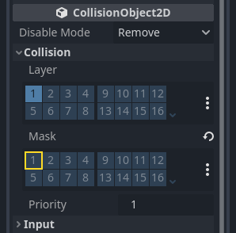
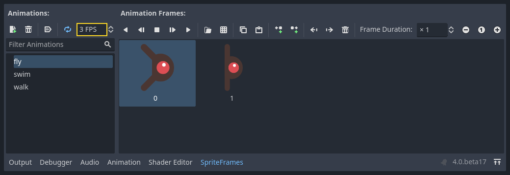

import Tabs from "@theme/Tabs";
import TabItem from "@theme/TabItem";

# Creating the enemy

Now it's time to make the enemies our player will have to dodge. Their behavior
will not be very complex: mobs will spawn randomly at the edges of the screen,
choose a random direction, and move in a straight line.

We'll create a ``Mob`` scene, which we can then *instance* to create any number
of independent mobs in the game.

## Node setup

Click Scene -&gt; New Scene from the top menu and add the following nodes:

- [RigidBody2D](/docs/Classes/RigidBody2D) (named ``Mob``)

   - [AnimatedSprite2D](/docs/Classes/AnimatedSprite2D)
   - [CollisionShape2D](/docs/Classes/CollisionShape2D)
   - [VisibleOnScreenNotifier2D](/docs/Classes/VisibleOnScreenNotifier2D)

Don't forget to set the children so they can't be selected, like you did with
the Player scene.

Select the ``Mob`` node and set its ``Gravity Scale``
property in the [RigidBody2D](/docs/Classes/RigidBody2D)
section of the inspector to ``0``.
This will prevent the mob from falling downwards.

In addition, under the [CollisionObject2D](/docs/Classes/CollisionObject2D)
section just beneath the **RigidBody2D** section,
expand the **Collision** group and
uncheck the ``1`` inside the ``Mask`` property.
This will ensure the mobs do not collide with each other.



Set up the [AnimatedSprite2D](/docs/Classes/AnimatedSprite2D) like you did for the
player. This time, we have 3 animations: ``fly``, ``swim``, and ``walk``. There
are two images for each animation in the art folder.

The ``Animation Speed`` property has to be set for each individual animation. Adjust it to ``3`` for all 3 animations.



You can use the "Play Animation" buttons on the right of the ``Animation Speed`` input field to preview your animations.

We'll select one of these animations randomly so that the mobs will have some
variety.

Like the player images, these mob images need to be scaled down. Set the
``AnimatedSprite2D``'s ``Scale`` property to ``(0.75, 0.75)``.

As in the ``Player`` scene, add a ``CapsuleShape2D`` for the collision. To align
the shape with the image, you'll need to set the ``Rotation`` property
to ``90`` (under "Transform" in the Inspector).

Save the scene.

## Enemy script

Add a script to the ``Mob`` like this:

<Tabs>

<TabItem value="gdscript" label="GDScript">

```gdscript
extends RigidBody2D

```

</TabItem>

<TabItem value="csharp" label="Csharp">

```csharp
using Godot;

public partial class Mob : RigidBody2D
{
    // Don't forget to rebuild the project.
}
```

</TabItem>

</Tabs>

Now let's look at the rest of the script. In ``_ready()`` we play the animation
and randomly choose one of the three animation types:

<Tabs>

<TabItem value="gdscript" label="GDScript">

```gdscript
func _ready():
    var mob_types = $AnimatedSprite2D.sprite_frames.get_animation_names()
    $AnimatedSprite2D.play(mob_types[randi() % mob_types.size()])

```

</TabItem>

<TabItem value="csharp" label="Csharp">

```csharp
public override void _Ready()
{
    var animatedSprite2D = GetNode<AnimatedSprite2D>("AnimatedSprite2D");
    string[] mobTypes = animatedSprite2D.SpriteFrames.GetAnimationNames();
    animatedSprite2D.Play(mobTypes[GD.Randi() % mobTypes.Length]);
}
```

</TabItem>

</Tabs>

First, we get the list of animation names from the AnimatedSprite2D's ``sprite_frames``
property. This returns an Array containing all three animation names: ``["walk",
"swim", "fly"]``.

We then need to pick a random number between ``0`` and ``2`` to select one of
these names from the list (array indices start at ``0``). ``randi() % n``
selects a random integer between ``0`` and ``n-1``.

The last piece is to make the mobs delete themselves when they leave the screen.
Connect the ``screen_exited()`` signal of the ``VisibleOnScreenNotifier2D`` node
to the ``Mob`` and add this code:

<Tabs>

<TabItem value="gdscript" label="GDScript">

```gdscript
func _on_visible_on_screen_notifier_2d_screen_exited():
    queue_free()

```

</TabItem>

<TabItem value="csharp" label="Csharp">

```csharp
// We also specified this function name in PascalCase in the editor's connection window.
private void OnVisibleOnScreenNotifier2DScreenExited()
{
    QueueFree();
}
```

</TabItem>

</Tabs>

This completes the `Mob` scene.

With the player and enemies ready, in the next part, we'll bring them together
in a new scene. We'll make enemies spawn randomly around the game board and move
forward, turning our project into a playable game.