# First look at Redot's interface

This page will give you a brief overview of Redot's interface. We're going to
look at the different main screens and docks to help you situate yourself.

:::info
For a comprehensive breakdown of the editor's interface and how to
use it, see the [Editor manual](../../tutorials/editor/index.md).

:::

## The Project Manager

When you launch Redot, the first window you see is the Project Manager. In the
default tab **Projects**, you can manage existing projects, import or create new
ones, and more.

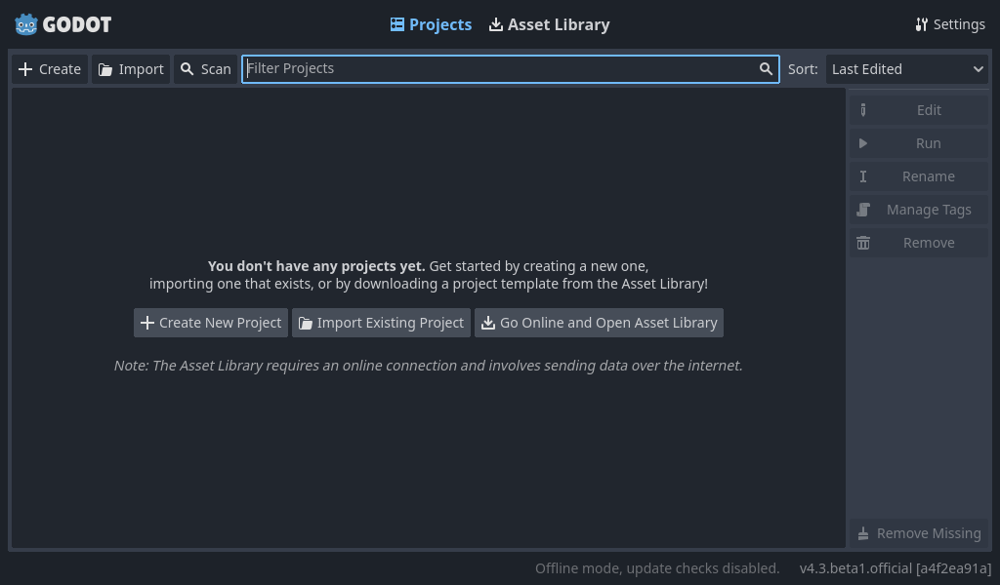

At the top of the window, there is another tab named **Asset Library**. The first
time you go to this tab you'll see a "Go Online" button. For privacy reasons, the Redot
project manager does not access the internet by default. To change this click
the "Go Online" button. You can change this option later in the settings.

Once your network mode is set to "online", you can search for demo projects in the open
source asset library, which includes many projects developed by the community:

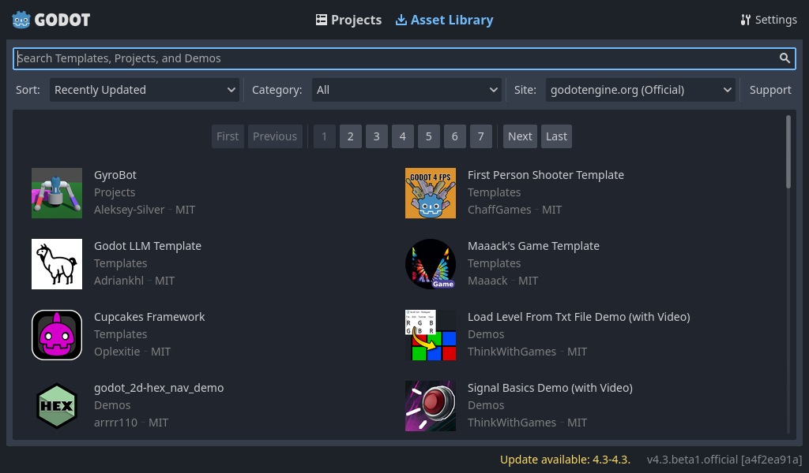

The Project Manager's settings can be opened using the **Settings** menu:

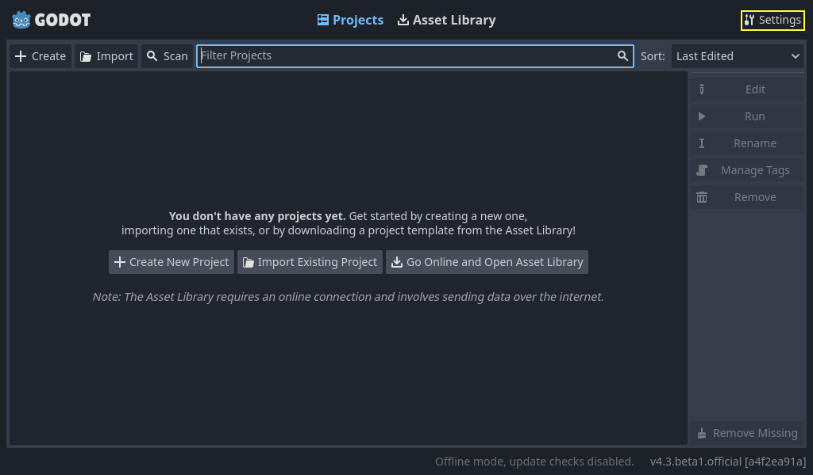

From here, you can change the editor's language (default is the system language), interface theme, display 
scale, network mode, and also the directory naming convention.

:::info
To learn the Project Manager's ins and outs, read
[doc_project_manager](../../tutorials/editor/project_manager.md).

:::

## First look at Redot's editor

When you open a new or an existing project, the editor's interface appears.
Let's look at its main areas:

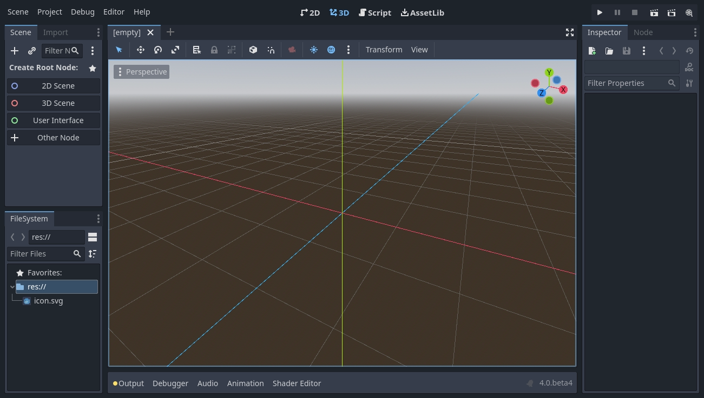

By default, along the window's top edge, it features **main menu** on the left, **workspace** switching 
buttons in the center (active workspace is highlighted), and **playtest** buttons on the right:

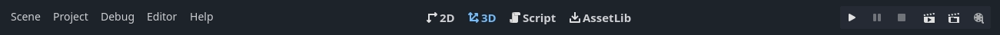

Just below the workspace buttons, the opened [scenes](doc_key_concepts_overview_scenes)
as tabs are seen. The plus (+) button right next to the tabs will add a new scene to the project.
With the button on the far right, distraction-free mode can be toggled, which maximizes or restores 
the **viewport**'s size by hiding **docks** in the interface:

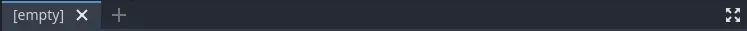

In the center, below the scene selector is the **viewport** with its **toolbar** at the top, where you'll
find different tools to move, scale, or lock the scene's nodes (currently the 3D workspace is active):

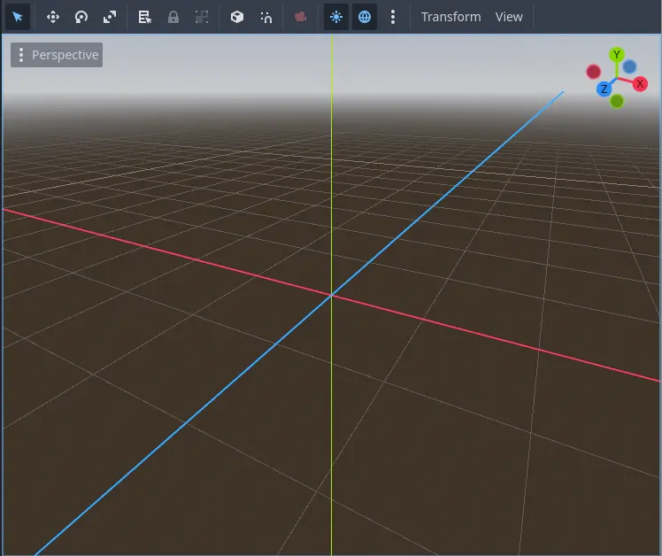

This toolbar changes based on the context and selected node. Here is the 2D toolbar:

Below is the 3D one:

:::info
To learn more on workspaces, read [doc_intro_to_the_editor_interface_four_screens](doc_intro_to_the_editor_interface_four_screens).

:::

:::info
To learn more on the 3D viewport and 3D in general, read [doc_introduction_to_3d](../../tutorials/3d/introduction_to_3d.md).

:::

On either side of the viewport sit the **docks**. And at the bottom of the
window lies the **bottom panel**.

Let's look at the docks. The **FileSystem** dock lists your project files, including
scripts, images, audio samples, and more:

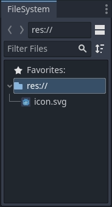

The **Scene** dock lists the active scene's nodes:

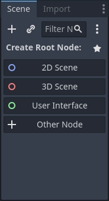

The **Inspector** allows you to edit the properties of a selected node:

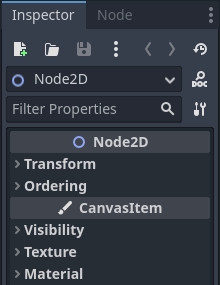

:::info
To read more on inspector, see [doc_editor_inspector_dock](../../tutorials/editor/inspector_dock.md).

:::

:::info
Docks can be customized. Read more on [doc_customizing_editor_moving_docks](doc_customizing_editor_moving_docks).

:::

The **bottom panel**, situated below the viewport, is the host for the debug
console, the animation editor, the audio mixer, and more. They can take precious
space, that's why they're folded by default:

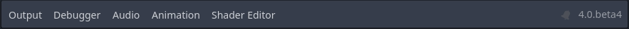

When you click on one, it expands vertically. Below, you can see the animation editor opened:

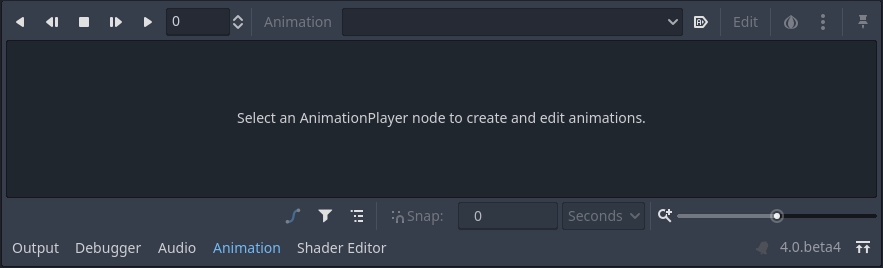

Bottom panels can also be shown or hidden using the shortcuts defined in 
**Editor Settings &gt; Shortcuts**, under the **Bottom Panels** category.

## The four main screens

There are four main screen buttons centered at the top of the editor:
2D, 3D, Script, and Asset Library.

You'll use the **2D screen** for all types of games. In addition to 2D games,
the 2D screen is where you'll build your interfaces.

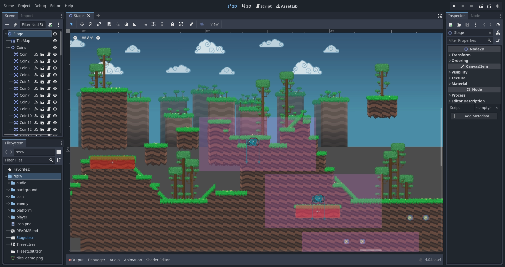

In the **3D screen**, you can work with meshes, lights, and design levels for
3D games.

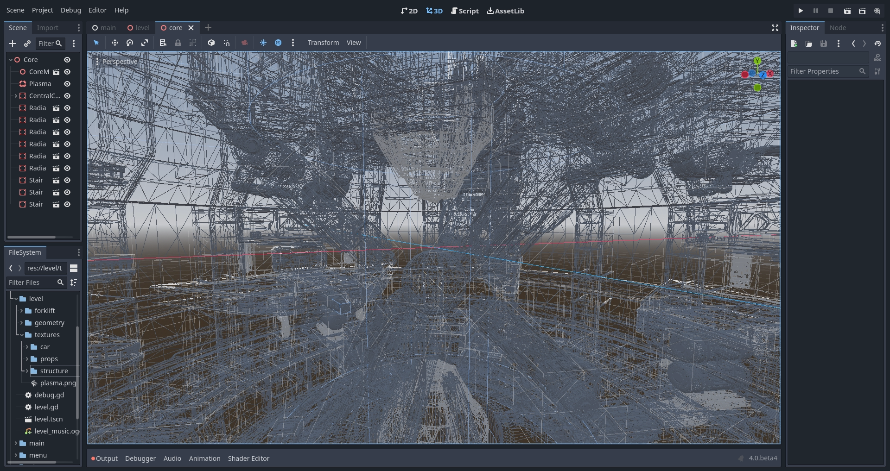

:::note
Read [doc_introduction_to_3d](../../tutorials/3d/introduction_to_3d.md) for more detail about the **3D
main screen**.

:::

The **Script screen** is a complete code editor with a debugger, rich
auto-completion, and built-in code reference.

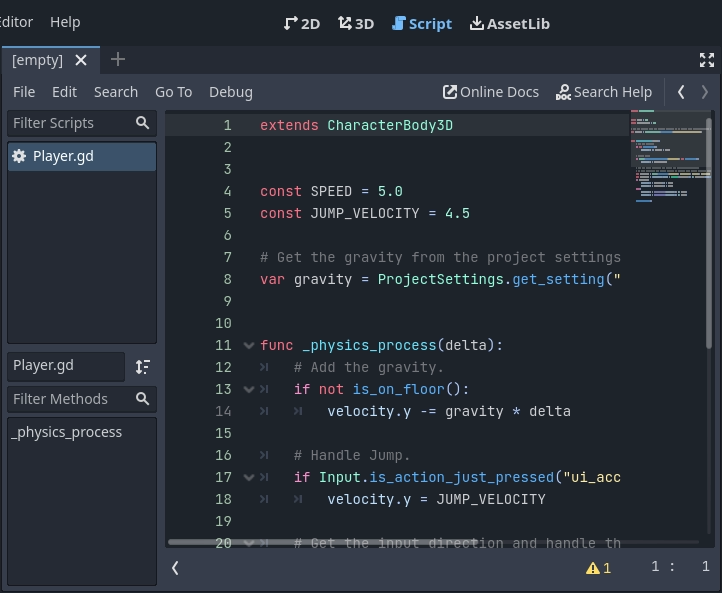

Finally, the **Asset Library** is a library of free and open source add-ons, scripts,
and assets to use in your projects.

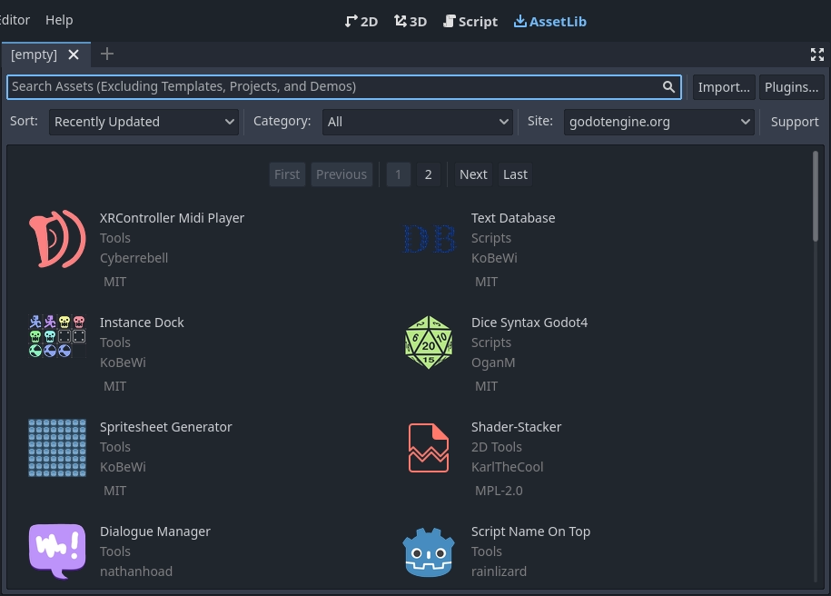

:::info
You can learn more about the asset library in
[doc_what_is_assetlib](../../Community/asset_library/what_is_assetlib.md).

:::

## Integrated class reference

Redot comes with a built-in class reference.

You can search for information about a class, method, property, constant, or
signal by any one of the following methods:

* Pressing `F1` (or `Opt + Space` on macOS, or `Fn + F1` for laptops 
  with a `Fn` key) anywhere in the editor.
* Clicking the "Search Help" button in the top-right of the Script main screen.
* Clicking on the Help menu and Search Help.
* `Ctrl + Click` (`Cmd + Click` on macOS) on a class name, function name, 
  or built-in variable in the script editor.

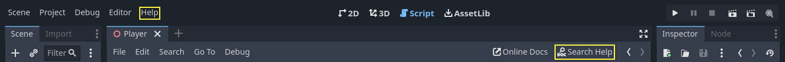

When you do any of these, a window pops up. Type to search for any item. You can
also use it to browse available objects and methods.

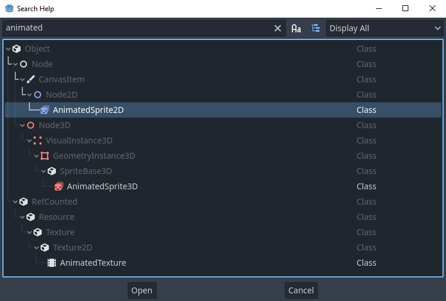

Double-click on an item to open the corresponding page in the script main screen.

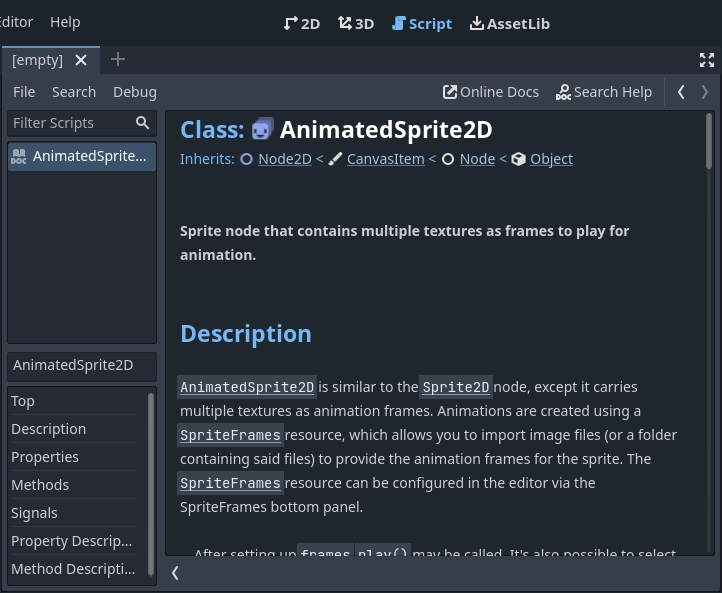

Alternatively,

* Clicking while pressing the `Ctrl` key on a class name, function name,
  or built-in variable in the script editor.
* Right-clicking on nodes and choosing **Open Documentation** or choosing **Lookup Symbol**
  for elements in script editor will directly open their documentation.