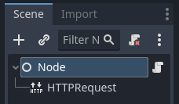

import Tabs from "@theme/Tabs";
import TabItem from "@theme/TabItem";

# Making HTTP requests

## Why use HTTP?

[HTTP requests ](https://developer.mozilla.org/en-US/docs/Web/HTTP) are useful
to communicate with web servers and other non-Redot programs.

Compared to Redot's other networking features (like
[High-level multiplayer ](high_level_multiplayer.md)),
HTTP requests have more overhead and take more time to get going,
so they aren't suited for real-time communication, and aren't great to send
lots of small updates as is common for multiplayer gameplay.

HTTP, however, offers interoperability with external
web resources and is great at sending and receiving large amounts
of data, for example to transfer files like game assets. These assets can then
be loaded using
[runtime file loading and saving ](../io/runtime_file_loading_and_saving.md).

So HTTP may be useful for your game's login system, lobby browser,
to retrieve some information from the web or to download game assets.

This tutorial assumes some familiarity with Redot and the Redot Editor.
Refer to the [Introduction ](toc-learn-introduction) and the
[Step by step ](toc-learn-step_by_step) tutorial, especially its
[Nodes and Scenes ](../../Getting Started/step_by_step/nodes_and_scenes.md) and
[Creating your first script ](../../Getting Started/step_by_step/scripting_first_script.md) pages if needed.

## HTTP requests in Redot

The [HTTPRequest ](/docs/Classes/HTTPRequest) node is the easiest way to make HTTP requests in Redot.
It is backed by the more low-level [HTTPClient ](/docs/Classes/HTTPClient),
for which a tutorial is available [here ](http_client_class.md).

For this example, we will make an HTTP request to GitHub to retrieve the name
of the latest Redot release.

:::warning

When exporting to **Android**, make sure to enable the **Internet**
permission in the Android export preset before exporting the project or
using one-click deploy. Otherwise, network communication of any kind will be
blocked by the Android OS.

:::

## Preparing the scene

Create a new empty scene, add a root [Node ](/docs/Classes/Node) and add a script to it.
Then add an [HTTPRequest ](/docs/Classes/HTTPRequest) node as a child.



## Scripting the request

When the project is started (so in ``_ready()``), we're going to send an HTTP request
to Github using our [HTTPRequest ](/docs/Classes/HTTPRequest) node,
and once the request completes, we're going to parse the returned JSON data,
look for the ``name`` field and print that to console.

<Tabs>

<TabItem value="gdscript" label="GDScript">

```gdscript
extends Node

func _ready():
    $HTTPRequest.request_completed.connect(_on_request_completed)
    $HTTPRequest.request("https://api.github.com/repos/Redotengine/Redot/releases/latest")

func _on_request_completed(result, response_code, headers, body):
    var json = JSON.parse_string(body.get_string_from_utf8())
    print(json["name"])

```

</TabItem>

<TabItem value="csharp" label="Csharp">

```csharp
using Godot;
using System.Text;

public partial class MyNode : Node
{
    public override void _Ready()
    {
        HttpRequest httpRequest = GetNode<HttpRequest>("HTTPRequest");
        httpRequest.RequestCompleted += OnRequestCompleted;
        httpRequest.Request("https://api.github.com/repos/Redotengine/Redot/releases/latest");
    }

    private void OnRequestCompleted(long result, long responseCode, string[] headers, byte[] body)
    {
        Godot.Collections.Dictionary json = Json.ParseString(Encoding.UTF8.GetString(body)).AsGodotDictionary();
        GD.Print(json["name"]);
    }
}

```

</TabItem>

</Tabs>

Save the script and the scene, and run the project.
The name of the most recent Redot release on Github should be printed to the output log.
For more information on parsing JSON, see the class references for [JSON ](/docs/Classes/JSON).

Note that you may want to check whether the ``result`` equals ``RESULT_SUCCESS``
and whether a JSON parsing error occurred, see the JSON class reference and
[HTTPRequest ](/docs/Classes/HTTPRequest) for more.

You have to wait for a request to finish before sending another one.
Making multiple request at once requires you to have one node per request.
A common strategy is to create and delete HTTPRequest nodes at runtime as necessary.

## Sending data to the server

Until now, we have limited ourselves to requesting data from a server.
But what if you need to send data to the server? Here is a common way of doing it:

<Tabs>

<TabItem value="gdscript" label="GDScript">

```gdscript
var json = JSON.stringify(data_to_send)
var headers = ["Content-Type: application/json"]
$HTTPRequest.request(url, headers, HTTPClient.METHOD_POST, json)

```

</TabItem>

<TabItem value="csharp" label="Csharp">

```csharp
string json = Json.Stringify(dataToSend);
string[] headers = ["Content-Type: application/json"];
HttpRequest httpRequest = GetNode<HttpRequest>("HTTPRequest");
httpRequest.Request(url, headers, HttpClient.Method.Post, json);

```

</TabItem>

</Tabs>

## Setting custom HTTP headers

Of course, you can also set custom HTTP headers. These are given as a string array,
with each string containing a header in the format ``"header: value"``.
For example, to set a custom user agent (the HTTP ``User-Agent`` header) you could use the following:

<Tabs>

<TabItem value="gdscript" label="GDScript">

```gdscript
$HTTPRequest.request("https://api.github.com/repos/Redotengine/Redot/releases/latest", ["User-Agent: YourCustomUserAgent"])

```

</TabItem>

<TabItem value="csharp" label="Csharp">

```csharp
HttpRequest httpRequest = GetNode<HttpRequest>("HTTPRequest");
httpRequest.Request("https://api.github.com/repos/Redotengine/Redot/releases/latest", ["User-Agent: YourCustomUserAgent"]);

```

</TabItem>

</Tabs>

.. danger::

    Be aware that someone might analyse and decompile your released application and
    thus may gain access to any embedded authorization information like tokens, usernames or passwords.
    That means it is usually not a good idea to embed things such as database
    access credentials inside your game. Avoid providing information useful to an attacker whenever possible.