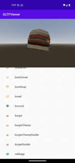

# Redot Android library

The Redot Engine for Android platforms is designed to be used as an [Android library ](https://developer.android.com/studio/projects/android-library).
This architecture enables several key features on Android platforms:

- Ability to integrate the Gradle build system within the Redot Editor, which provides the ability to leverage more components from the Android ecosystem such as libraries and tools

- Ability to make the engine portable and embeddable:

  - Key in enabling the port of the Redot Editor to Android and mobile XR devices
  - Key in allowing the integration and reuse of Redot's capabilities within existing codebase

Below we describe some of the use-cases and scenarios this architecture enables.

## Using the Redot Android library

The Redot Android library is packaged as an AAR archive file and hosted on [MavenCentral ](https://central.sonatype.com/artifact/org.godotengine/Redot) along with [its documentation ](https://javadoc.io/doc/org.godotengine/Redot/latest/index.html).

It provides access to Redot APIs and capabilities on Android platforms for the following non-exhaustive use-cases.

## Redot Android plugins

Android plugins are powerful tools to extend the capabilities of the Redot Engine
by tapping into the functionality provided by Android platforms and ecosystem.

An Android plugin is an Android library with a dependency on the Redot Android library
which the plugin uses to integrate into the engine's lifecycle and to access Redot APIs,
granting it powerful capabilities such as GDExtension support which allows to update / mod the engine behavior as needed.

For more information, see [Redot Android plugins ](android_plugin.md).

## Embedding Redot in existing Android projects

The Redot Engine can be embedded within existing Android applications or libraries,
allowing developers to leverage mature and battle-tested code and libraries better suited to a specific task.

The hosting component is responsible for driving the engine lifecycle via Redot's Android APIs.
These APIs can also be used to provide bidirectional communication between the host and the embedded
Redot instance allowing for greater control over the desired experience.

We showcase how this is done using a sample Android app that embeds the Redot Engine as an Android view,
and uses it to render 3D glTF models.

The [GLTF Viewer ](https://github.com/m4gr3d/Godot-Android-Samples/tree/master/apps/gltf_viewer) sample app uses an [Android RecyclerView component ](https://developer.android.com/develop/ui/views/layout/recyclerview) to create
a list of glTF items, populated from [Kenney's Food Kit pack ](https://kenney.nl/assets/food-kit).
When an item on the list is selected, the app's logic interacts with the embedded Redot Engine to render the selected glTF item as a 3D model.



The sample app source code can be found [on GitHub ](https://github.com/m4gr3d/Godot-Android-Samples/tree/master/apps/gltf_viewer).
Follow the instructions on [its README ](https://github.com/m4gr3d/Godot-Android-Samples/blob/master/apps/gltf_viewer/README.md) to build and install it.

Below we break-down the steps used to create the GLTF Viewer app.

:::warning

Currently only a single instance of the Redot Engine is supported per process.
You can configure the process the Android Activity runs under using the [android:process attribute ](https://developer.android.com/guide/topics/manifest/activity-element#proc).

:::

:::warning

Automatic resizing / orientation configuration events are not supported and may cause a crash.
You can disable those events:

- By locking to a specific orientation using the [android:screenOrientation attribute ](https://developer.android.com/guide/topics/manifest/activity-element#screen).
- By declaring that the Activity will handle these configuration events using the [android:configChanges attribute ](https://developer.android.com/guide/topics/manifest/activity-element#config).

:::

### 1. Create the Android app

:::note

The Android sample app was created using [Android Studio ](https://developer.android.com/studio)
and using [Gradle ](https://developer.android.com/build) as the build system.

The Android ecosystem provides multiple tools, IDEs, build systems for creating Android apps
so feel free to use what you're familiar with, and update the steps below accordingly (contributions to this documentation are welcomed as well!).

:::

- Set up an Android application project. It may be a brand new empty project, or an existing project
- Add the [maven dependency for the Redot Android library ](https://central.sonatype.com/artifact/org.godotengine/Redot)

  - If using ``gradle``, add the following to the ``dependency`` section of the app's gradle build file. Make sure to update ``&lt;version&gt;`` to the latest version of the Redot Android library:

```kotlin
implementation("org.godotengine:godot:<version>")

```

- If using ``gradle``, include the following ``aaptOptions`` configuration under the ``android &gt; defaultConfig`` section of the app's gradle build file. Doing so allows ``gradle`` to include Redot's hidden directories when building the app binary.

  - If your build system does not support including hidden directories, you can
    configure the Redot project to not use hidden directories by deselecting 
    [Application &gt; Config &gt; Use Hidden Project Data Directory](/docs/Classes/ProjectSettings_property_application/config/use_hidden_project_data_directory)
    in the Project Settings.

```groovy
android {

  defaultConfig {
      // The default ignore pattern for the 'assets' directory includes hidden files and
      // directories which are used by Redot projects, so we override it with the following.
      aaptOptions {
          ignoreAssetsPattern "!.svn:!.git:!.gitignore:!.ds_store:!*.scc:<dir>_*:!CVS:!thumbs.db:!picasa.ini:!*~"
      }
    ...

```

- Create / update the application's Activity that will be hosting the Redot Engine instance. For the sample app, this is [MainActivity ](https://github.com/m4gr3d/Godot-Android-Samples/blob/master/apps/gltf_viewer/src/main/java/fhuyakou/Redot/app/android/gltfviewer/MainActivity.kt)

  - The host Activity should implement the [RedotHost interface ](https://github.com/redot-engine/redot-engine/blob/master/platform/android/java/lib/src/org/Redotengine/Redot/RedotHost.java)
  - The sample app uses [Fragments ](https://developer.android.com/guide/fragments) to organize its UI, so it uses [RedotFragment ](https://github.com/redot-engine/redot-engine/blob/master/platform/android/java/lib/src/org/Redotengine/Redot/RedotFragment.java), a fragment component provided by the Redot Android library to automatically host and manage the Redot Engine instance.

```kotlin
private var RedotFragment: RedotFragment? = null

override fun onCreate(savedInstanceState: Bundle?) {
    super.onCreate(savedInstanceState)

    setContentView(R.layout.activity_main)

    val currentRedotFragment = supportFragmentManager.findFragmentById(R.id.Redot_fragment_container)
    if (currentRedotFragment is RedotFragment) {
        RedotFragment = currentRedotFragment
    } else {
        RedotFragment = RedotFragment()
        supportFragmentManager.beginTransaction()
            .replace(R.id.Redot_fragment_container, RedotFragment!!)
            .commitNowAllowingStateLoss()
    }

    ...

```

:::note

The Redot Android library also provide [RedotActivity ](https://github.com/redot-engine/redot-engine/blob/master/platform/android/java/lib/src/org/Redotengine/Redot/RedotActivity.kt), an Activity component that can be extended to automatically host and manage the Redot Engine instance.

Alternatively, applications can directly create a [Redot ](https://github.com/redot-engine/redot-engine/blob/master/platform/android/java/lib/src/org/Redotengine/Redot/Redot.kt) instance, host and manage it themselves.

:::

- Using [RedotHost#getHostPlugins(...) ](https://github.com/m4gr3d/Godot-Android-Samples/blob/0e3440f357f8be5b4c63a4fe75766793199a99d0/apps/gltf_viewer/src/main/java/fhuyakou/Redot/app/android/gltfviewer/MainActivity.kt#L55), the sample app creates a [runtime GodotPlugin instance ](https://github.com/m4gr3d/Godot-Android-Samples/blob/master/apps/gltf_viewer/src/main/java/fhuyakou/Redot/app/android/gltfviewer/AppPlugin.kt) that's used to send [signals ](../../../Getting Started/step_by_step/signals.md) to the ``gdscript`` logic

  - The runtime ``GodotPlugin`` can also be used by ``gdscript`` logic to access JVM methods. For more information, see [Redot Android plugins ](android_plugin.md).

- Add any additional logic that will be used by your application

  - For the sample app, this includes adding the [ItemsSelectionFragment fragment ](https://github.com/m4gr3d/Godot-Android-Samples/blob/master/apps/gltf_viewer/src/main/java/fhuyakou/Redot/app/android/gltfviewer/ItemsSelectionFragment.kt) (and related classes), a fragment used to build and show the list of glTF items

- Open the [`AndroidManifest.xml`` file, and configure the orientation if needed using the `android:screenOrientation attribute ](https://developer.android.com/guide/topics/manifest/activity-element#screen)

  - If needed, disable automatic resizing / orientation configuration changes using the [android:configChanges attribute ](https://developer.android.com/guide/topics/manifest/activity-element#config)

```xml
<activity android:name=".MainActivity"
    android:screenOrientation="fullUser"
    android:configChanges="orientation|screenSize|smallestScreenSize|screenLayout"
    android:exported="true">

    ...
</activity>

```

### 2. Create the Redot project

:::note

On Android, Redot's project files are exported to the ``assets`` directory of the generated ``apk`` binary.

We leverage that architecture to bind our Android app and Redot project together by creating the Redot project in the Android app's ``assets`` directory.

Note that it's also possible to create the Redot project in a separate directory and export it as a [PCK or ZIP file ](https://docs.redotengine.org/en/stable/tutorials/export/exporting_projects.html#pck-versus-zip-pack-file-formats)
to the Android app's ``assets`` directory.
Using this approach requires passing the ``--main-pack &lt;pck_or_zip_filepath_relative_to_assets_dir&gt;[` argument to the hosted Redot Engine instance using `RedotHost#getCommandLine() ](https://github.com/redot-engine/redot-engine/blob/6916349697a4339216469e9bf5899b983d78db07/platform/android/java/lib/src/org/Redotengine/Redot/RedotHost.java#L45).

The instructions below and the sample app follow the first approach of creating the Redot project in the Android app's ``assets`` directory.

:::

- As mentioned in the **note** above, open the Redot Editor and create a Redot project directly (no subfolder) in the ``assets`` directory of the Android application project

  - See the sample app's [Redot project ](https://github.com/m4gr3d/Godot-Android-Samples/tree/master/apps/gltf_viewer/src/main/assets) for reference

- Configure the Redot project as desired

  - Make sure the [orientation ](https://docs.redotengine.org/en/stable/classes/class_projectsettings.html#class-projectsettings-property-display-window-handheld-orientation) set for the Redot project matches the one set in the Android app's manifest
  - For Android, make sure [textures/vram_compression/import_etc2_astc ](https://docs.redotengine.org/en/stable/classes/class_projectsettings.html#class-projectsettings-property-rendering-textures-vram-compression-import-etc2-astc) is set to `true`

- Update the Redot project script logic as needed

  - For the sample app, the [script logic ](https://github.com/m4gr3d/Godot-Android-Samples/blob/master/apps/gltf_viewer/src/main/assets/main.gd) queries for the runtime ``GodotPlugin`` instance and uses it to register for signals fired by the app logic
  - The app logic fires a signal every time an item is selected in the list. The signal contains the filepath of the glTF model, which is used by the ``gdscript`` logic to render the model.

```gdscript
extends Node3D

# Reference to the gltf model that's currently being shown.
var current_gltf_node: Node3D = null

func _ready():
  # Default asset to load when the app starts
  _load_gltf("res://gltfs/food_kit/turkey.glb")

  var appPlugin = Engine.get_singleton("AppPlugin")
  if appPlugin:
    print("App plugin is available")

    # Signal fired from the app logic to update the gltf model being shown
    appPlugin.connect("show_gltf", _load_gltf)
  else:
    print("App plugin is not available")

# Load the gltf model specified by the given path
func _load_gltf(gltf_path: String):
  if current_gltf_node != null:
    remove_child(current_gltf_node)

  current_gltf_node = load(gltf_path).instantiate()

  add_child(current_gltf_node)

```

### 3. Build and run the app

Once you complete configuration of your Redot project, build and run the Android app.
If set up correctly, the host Activity will initialize the embedded Redot Engine on startup.
The Redot Engine will check the ``assets`` directory for project files to load (unless configured to look for a ``main pack``), and will proceed to run the project.

While the app is running on device, you can check [Android logcat ](https://developer.android.com/studio/debug/logcat) to investigate any errors or crashes.

For reference, check the [build and install instructions ](https://github.com/m4gr3d/Godot-Android-Samples/blob/master/apps/gltf_viewer/README.md) for the GLTF Viewer sample app.