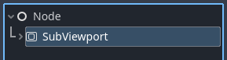
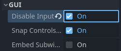
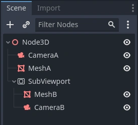
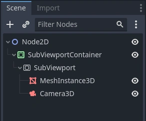
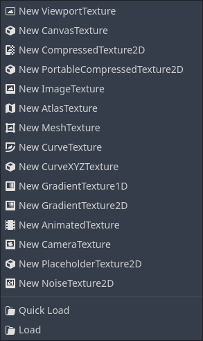
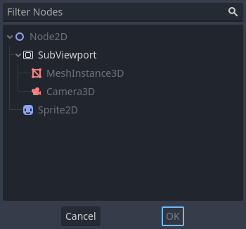

import Tabs from "@theme/Tabs";
import TabItem from "@theme/TabItem";

# Using Viewports

## Introduction

Think of a [Viewport ](/docs/Classes/Viewport) as a screen onto which the game is projected. In order
to see the game, we need to have a surface on which to draw it. That surface is
the Root Viewport.


are multiple surfaces to draw on. When we are drawing to a SubViewport, we call it a render target. We can access the contents
of a render target by accessing its corresponding [texture ](/docs/Classes/Viewport_method_get_texture).
By using a SubViewport as render target, we can either render multiple scenes simultaneously or we can render to
a [ViewportTexture ](/docs/Classes/ViewportTexture) which is applied to an object in the scene, for example a dynamic
skybox.

[SubViewports ](/docs/Classes/SubViewport) have a variety of use cases, including:

- Rendering 3D objects within a 2D game
- Rendering 2D elements in a 3D game
- Rendering dynamic textures
- Generating procedural textures at runtime
- Rendering multiple cameras in the same scene

What all these use cases have in common is that you are given the ability to
draw objects to a texture as if it were another screen and can then choose
what to do with the resulting texture.

Another kind of Viewports in Redot are [Windows ](/docs/Classes/Window). They allow their content to be projected onto a window. While the Root Viewport is a Window, they are less
flexible. If you want to use the texture of a Viewport, you'll be working with [SubViewports ](/docs/Classes/SubViewport) most of the time.

## Input

[Viewports ](/docs/Classes/Viewport) are also responsible for delivering properly adjusted and
scaled input events to their children nodes. By default [SubViewports ](/docs/Classes/SubViewport) don't
automatically receive input, unless they receive it from their direct
[SubViewportContainer ](/docs/Classes/SubViewportContainer) parent node. In this case, input can be
disabled with the [Disable Input ](/docs/Classes/Viewport_property_gui_disable_input) property.



For more information on how Redot handles input, please read the [Input Event Tutorial ](../inputs/inputevent.md).

## Listener

Redot supports 3D sound (in both 2D and 3D nodes). More on this can be
found in the [Audio Streams Tutorial ](../audio/audio_streams.md). For this type of sound to be
audible, the [Viewport ](/docs/Classes/Viewport) needs to be enabled as a listener (for 2D or 3D).
If you are using a [SubViewport ](/docs/Classes/SubViewport) to display your [World3D ](/docs/Classes/World3D) or
[World2D ](/docs/Classes/World2D), don't forget to enable this!

## Cameras (2D & 3D)

When using a [Camera3D ](/docs/Classes/Camera3D) or
[Camera2D ](/docs/Classes/Camera2D), it will always display on the
closest parent [Viewport ](/docs/Classes/Viewport) (going towards the root). For example, in the
following hierarchy:



``CameraA`` will display on the Root [Viewport ](/docs/Classes/Viewport) and it will draw ``MeshA``. ``CameraB``
will be captured by the [SubViewport ](/docs/Classes/SubViewport) along with ``MeshB``. Even though ``MeshB`` is in the scene
hierarchy, it will still not be drawn to the Root Viewport. Similarly, ``MeshA`` will not
be visible from the SubViewport because SubViewports only
capture nodes below them in the hierarchy.

There can only be one active camera per [Viewport ](/docs/Classes/Viewport), so if there is more
than one, make sure that the desired one has the [current ](/docs/Classes/Camera3D_property_current) property set,
or make it the current camera by calling:

<Tabs>

<TabItem value="gdscript" label="GDScript">

```gdscript
camera.make_current()

```

</TabItem>

<TabItem value="csharp" label="Csharp">

```csharp
camera.MakeCurrent();

```

</TabItem>

</Tabs>

By default, cameras will render all objects in their world. In 3D, cameras can use their
[cull_mask ](/docs/Classes/Camera3D_property_cull_mask) property combined with the
[VisualInstance3D's ](/docs/Classes/VisualInstance3D) [layer ](/docs/Classes/VisualInstance3D_property_layers)
property to restrict which objects are rendered.

## Scale & stretching

[SubViewports ](/docs/Classes/SubViewport) have a [size](/docs/Classes/SubViewport_property_size) property, which represents the size of the SubViewport
in pixels. For SubViewports which are children of [SubViewportContainers ](/docs/Classes/SubViewportContainer),
these values are overridden, but for all others, this sets their resolution.

It is also possible to scale the 2D content and make the [SubViewport ](/docs/Classes/SubViewport) resolution
different from the one specified in size, by calling:

<Tabs>

<TabItem value="gdscript" label="GDScript">

```gdscript
sub_viewport.set_size_2d_override(Vector2i(width, height)) # Custom size for 2D.
sub_viewport.set_size_2d_override_stretch(true) # Enable stretch for custom size.

```

</TabItem>

<TabItem value="csharp" label="Csharp">

```csharp
subViewport.Size2DOverride = new Vector2I(width, height); // Custom size for 2D.
subViewport.Size2DOverrideStretch = true; // Enable stretch for custom size.

```

</TabItem>

</Tabs>

For information on scaling and stretching with the Root Viewport visit the [Multiple Resolutions Tutorial ](multiple_resolutions.md)

## Worlds

For 3D, a [Viewport ](/docs/Classes/Viewport) will contain a [World3D ](/docs/Classes/World3D). This
is basically the universe that links physics and rendering together.
Node3D-based nodes will register using the World3D of the closest Viewport.
By default, newly created Viewports do not contain a World3D but
use the same as their parent Viewport. The Root Viewport always contains a
World3D, which is the one objects are rendered to by default.

A [World3D ](/docs/Classes/World3D) can
be set in a [Viewport ](/docs/Classes/Viewport) using the [World 3D](/docs/Classes/Viewport_property_world_3d) property, that will separate
all children nodes of this [Viewport ](/docs/Classes/Viewport) and will prevent them from interacting with the parent
Viewport's World3D. This is especially useful in scenarios where, for
example, you might want to show a separate character in 3D imposed over
the game (like in StarCraft).

As a helper for situations where you want to create [Viewports ](/docs/Classes/Viewport) that
display single objects and don't want to create a [World3D ](/docs/Classes/World3D), Viewport has
the option to use its [Own World3D ](/docs/Classes/Viewport_property_own_world_3d). This is useful when you want to
instance 3D characters or objects in [World2D ](/docs/Classes/World2D).

For 2D, each [Viewport ](/docs/Classes/Viewport) always contains its own [World2D ](/docs/Classes/World2D).
This suffices in most cases, but in case sharing them may be desired, it
is possible to do so by setting [world_2d](/docs/Classes/Viewport_property_world_2d) on the Viewport through code.

For an example of how this works, see the demo projects [3D in 2D ](https://github.com/redot-engine/redot-demo-projects/tree/master/viewport/3d_in_2d) and [2D in 3D ](https://github.com/redot-engine/redot-demo-projects/tree/master/viewport/2d_in_3d) respectively.

## Capture

It is possible to query a capture of the [Viewport ](/docs/Classes/Viewport) contents. For the Root
Viewport, this is effectively a screen capture. This is done with the
following code:

<Tabs>

<TabItem value="gdscript" label="GDScript">

```gdscript
# Retrieve the captured Image using get_image().
var img = get_viewport().get_texture().get_image()
# Convert Image to ImageTexture.
var tex = ImageTexture.create_from_image(img)
# Set sprite texture.
sprite.texture = tex

```

</TabItem>

<TabItem value="csharp" label="Csharp">

```csharp
// Retrieve the captured Image using get_image().
var img = GetViewport().GetTexture().GetImage();
// Convert Image to ImageTexture.
var tex = ImageTexture.CreateFromImage(img);
// Set sprite texture.
sprite.Texture = tex;

```

</TabItem>

</Tabs>

But if you use this in ``_ready()`` or from the first frame of the [Viewport's ](/docs/Classes/Viewport) initialization,
you will get an empty texture because there is nothing to get as texture. You can deal with
it using (for example):

<Tabs>

<TabItem value="gdscript" label="GDScript">

```gdscript
# Wait until the frame has finished before getting the texture.
await RenderingServer.frame_post_draw
# You can get the image after this.

```

</TabItem>

<TabItem value="csharp" label="Csharp">

```csharp
// Wait until the frame has finished before getting the texture.
await RenderingServer.Singleton.ToSignal(RenderingServer.SignalName.FramePostDraw);
// You can get the image after this.

```

</TabItem>

</Tabs>

## Viewport Container

If the [SubViewport ](/docs/Classes/SubViewport) is a child of a [SubViewportContainer ](/docs/Classes/SubViewportContainer), it will become active and display anything it has inside. The layout looks like this:



The [SubViewport ](/docs/Classes/SubViewport) will cover the area of its parent [SubViewportContainer ](/docs/Classes/SubViewportContainer) completely
if [Stretch](/docs/Classes/SubViewportContainer_property_stretch) is set to ``true`` in the SubViewportContainer.

:::note

The size of the [SubViewportContainer ](/docs/Classes/SubViewportContainer) cannot be smaller than the size of the [SubViewport ](/docs/Classes/SubViewport).

:::

## Rendering

Due to the fact that the [Viewport ](/docs/Classes/Viewport) is an entryway into another rendering surface, it exposes a few
rendering properties that can be different from the project settings. You can
choose to use a different level of [MSAA ](/docs/Classes/Viewport_property_msaa_2d) for each Viewport. The default behavior is ``Disabled``.

If you know that the [Viewport ](/docs/Classes/Viewport) is only going to be used for 2D, you can [Disable 3D](/docs/Classes/Viewport_property_disable_3d). Redot will then
restrict how the Viewport is drawn.
Disabling 3D is slightly faster and uses less memory compared to enabled 3D. It's a good idea to disable 3D if your viewport doesn't render anything in 3D.

:::note

If you need to render 3D shadows in the viewport, make sure to set the viewport's [positional_shadow_atlas_size](/docs/Classes/Viewport_property_positional_shadow_atlas_size) property to a value higher than ``0``.
Otherwise, shadows won't be rendered. By default, the equivalent project setting is set to ``4096`` on desktop platforms and ``2048`` on mobile platforms.

:::

Redot also provides a way of customizing how everything is drawn inside [Viewports ](/docs/Classes/Viewport) using [Debug Draw](/docs/Classes/Viewport_property_debug_draw).
Debug Draw allows you to specify a mode which determines how the Viewport will display things drawn
inside it. Debug Draw is ``Disabled`` by default. Some other options are ``Unshaded``, ``Overdraw``, and ``Wireframe``. For a full list, refer to the [Viewport Documentation](/docs/Classes/Viewport_property_debug_draw).

-  **Debug Draw = Disabled** (default): The scene is drawn normally.

  .. image:: img/default_scene.webp

-  **Debug Draw = Unshaded**: Unshaded draws the scene without using lighting information so all the objects appear flatly colored in their albedo color.

  .. image:: img/unshaded.webp

-  **Debug Draw = Overdraw**: Overdraw draws the meshes semi-transparent with an additive blend so you can see how the meshes overlap.

  .. image:: img/overdraw.webp

-  **Debug Draw = Wireframe**: Wireframe draws the scene using only the edges of triangles in the meshes.

  .. image:: img/wireframe.webp

:::note

Debug Draw modes are currently **not** supported when using the
Compatibility rendering method. They will appear as regular draw modes.

:::

## Render target

When rendering to a [SubViewport ](/docs/Classes/SubViewport), whatever is inside will not be
visible in the scene editor. To display the contents, you have to draw the SubViewport's [ViewportTexture ](/docs/Classes/ViewportTexture) somewhere.
This can be requested via code using (for example):

<Tabs>

<TabItem value="gdscript" label="GDScript">

```gdscript
# This gives us the ViewportTexture.
var tex = viewport.get_texture()
sprite.texture = tex

```

</TabItem>

<TabItem value="csharp" label="Csharp">

```csharp
// This gives us the ViewportTexture.
var tex = viewport.GetTexture();
sprite.Texture = tex;

```

</TabItem>

</Tabs>

Or it can be assigned in the editor by selecting "New ViewportTexture"



and then selecting the [Viewport ](/docs/Classes/Viewport) you want to use.



Every frame, the [Viewport's ](/docs/Classes/Viewport) texture is cleared away with the default clear color (or a transparent
color if [Transparent BG](/docs/Classes/Viewport_property_transparent_bg) is set to ``true``). This can be changed by setting [Clear Mode](/docs/Classes/SubViewport_property_render_target_clear_mode) to ``Never`` or ``Next Frame``.
As the name implies, Never means the texture will never be cleared, while next frame will
clear the texture on the next frame and then set itself to Never.

By default, re-rendering of the [SubViewport ](/docs/Classes/SubViewport) happens when
its [ViewportTexture ](/docs/Classes/ViewportTexture) has been drawn in a frame. If visible, it will be
rendered, otherwise, it will not. This behavior can be changed by setting [Update Mode](/docs/Classes/SubViewport_property_render_target_update_mode) to ``Never``, ``Once``, ``Always``, or ``When Parent Visible``.
Never and Always will never or always re-render respectively. Once will re-render the next frame and change to Never afterwards. This can be used to manually update the Viewport.
This flexibility allows users to render an image once and then use the texture without incurring the cost of rendering every frame.

:::note

Make sure to check the Viewport demos. They are available in the
viewport folder of the demos archive, or at
https://github.com/redot-engine/redot-demo-projects/tree/master/viewport.

:::
